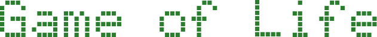

This is an interactive implementation of Conway's Game of Life made with Python.

## Game of Life

The [Game of Life](https://en.wikipedia.org/wiki/Conway%27s_Game_of_Life), also known simply as Life, is a cellular automaton devised by the British mathematician John Horton Conway in 1970. It is a zero-player game, meaning that its evolution is determined by its initial state, requiring no further input. One interacts with the Game of Life by creating an initial configuration and observing how it evolves.

This interactive implementation of the Game of Life allows you to create your own initial configuration and observe how it evolves. You can also pause the simulation, clear the grid and change the state of individual cells. It also includes some of the most famous patterns to get you started.

## Installation

1. Clone the repository:
```bash
git clone https://github.com/gabriel-rch/Game-of-Life.git
cd Game-of-Life
```

2. Install the dependencies:
```bash
pip install pygame
```

3. Run the game:
```bash
python main.py
```

## Controls

- **Left click**: Set cell as alive
- **Space**: Pause the simulation
- **C**: Clear the grid
- **R**: Randomize the grid

## Patterns

Some of the most common patterns are already included in the game. You can add your own patterns by creating a RLE file in the `patterns` folder. Refer to the [LifeWiki](https://conwaylife.com/wiki/Run_Length_Encoded) for more information on how to create your own patterns.
The wiki also provides a [list of known patterns](https://conwaylife.com/wiki/Category:Patterns) that you can use. Simply download the RLE
file and add it to the `patterns` folder.

## Contributing

If you would like to contribute to this project, please open an issue or a pull request. Any contributions are welcome!

## License

This project is licensed under the MIT License - see the [LICENSE](LICENSE) file for details.

<br>
<br>
<br>
